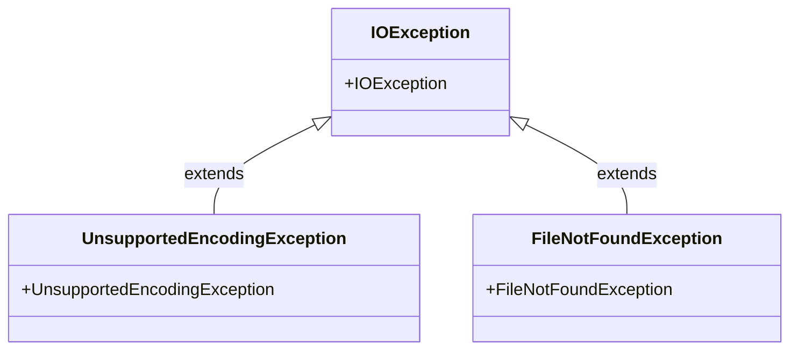

# Review
1. Javadoc
2. Naming rule
   1. method name begins with lowercase
   2. variable name begins with lowercase
   3. Class name begins with Uppercase
3. Exception hanlding:
   1. How to handle
      1. Logic handling
      2. Error
   2. Result
      1. Reasonable result
      2. Out error log

4. static to non-static
5. Fixed path→Relative path
 

# Homework
1. Ni
   1. FileOperate
      1. Add javadoc
      2. ~~Write test case for each method~~

   1. Try-Catch recfactoring
      1. Add javadoc
      2. Write test case for each method
2. Xiangyang
   1. Absolute path -> Relative path
   2. Use Assertion
   
   3. Assertion error
   4. How to assert System.out.println 

   1. Use Apache common library
   2. Handling lines by stream

3. Xiangyue
   1. Homework

   2. Idea-Eclipse(STS)

# github

1344161724@qq.com

javastudyaccount/javastudy123

