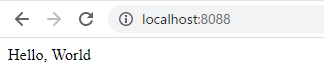
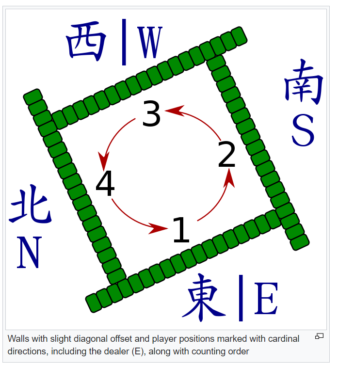
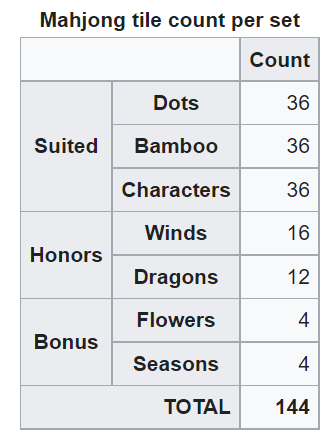
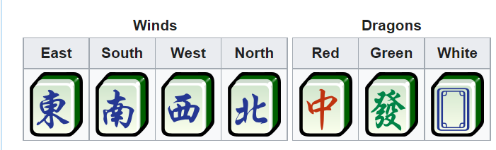
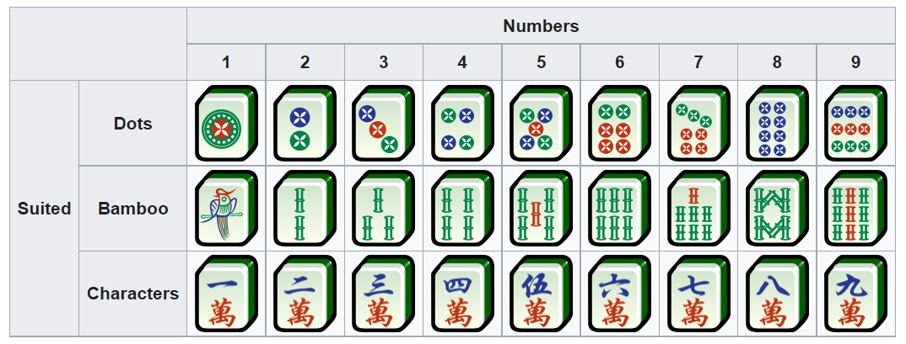

 mvn package -Dmaven.test.skip=true -Dmaven.javadoc.skip=true

## Beginner
1. Google searh "mnv springboot create multiproject"
2. [Creating a Multi Module Project](https://spring.io/guides/gs/multi-module/)
3. $ `mkdir mahjong`
4. $ `cd mahjong`
1. $ `mkdir library`
2. $ `mkdir application`
1. $ `mkdir -p application/src/main/java/jp/btsol/mahjong/application`
2. $ `mkdir -p library/src/main/java/jp/btsol/mahjong/service/`
1. $ `mkdir -p library/src/test/java/jp/btsol/mahjong/service/`
3. $ `mvn install && mvn spring-boot:run -pl application`
1. http://localhost:8088/
 
1. $ `git init`
2. $ `git add .`
1. $ `git commit -m init`

[Spring Bootとは? Spring BootでWebアプリ開発を始めるために必要な知識を紹介](https://i-common-tech.jp/column/940)
    [Spring BootでThymeleafを使ってhello worldを表示させる方法には？](https://i-common-tech.jp/column/940#Spring+Boot%E3%81%A7Thymeleaf%E3%82%92%E4%BD%BF%E3%81%A3%E3%81%A6hello+world%E3%82%92%E8%A1%A8%E7%A4%BA%E3%81%95%E3%81%9B%E3%82%8B%E6%96%B9%E6%B3%95%E3%81%AB%E3%81%AF%EF%BC%9F)

## [逆にWebAPIを呼び出してみよう編](https://zenn.dev/sugaryo/books/spring-boot-run-up/viewer/api_call)
  [RestTemplateラッパー三点セット](https://zenn.dev/sugaryo/books/spring-boot-run-up/viewer/api_call#%E2%96%A0resttemplate%E3%83%A9%E3%83%83%E3%83%91%E3%83%BC%E4%B8%89%E7%82%B9%E3%82%BB%E3%83%83%E3%83%88)
## Advanced
[組み込み Web サーバー](https://spring.pleiades.io/spring-boot/docs/2.1.4.RELEASE/reference/html/howto-embedded-web-servers.html)
    HTTP ポートを変更する
    ランダムな未割り当ての HTTP ポートを使用する
    実行時に HTTP ポートを発見する
    HTTP レスポンス圧縮を有効にする
    SSL を構成する
    HTTP/2 を構成する
    サーブレット、フィルター、またはリスナーをアプリケーションに追加する
        Spring Bean を使用して、サーブレット、フィルター、またはリスナーを追加する
        クラスパススキャンを使用してサーブレット、フィルター、リスナーを追加する
    アクセスログを構成する
    フロントエンドプロキシサーバーの背後で実行する
    @ServerEndpoint を使用して WebSocket エンドポイントを作成する

[Mahjong](https://en.wikipedia.org/wiki/Mahjong)

