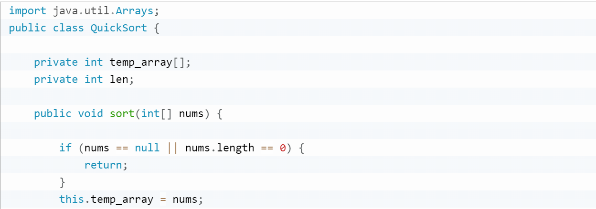
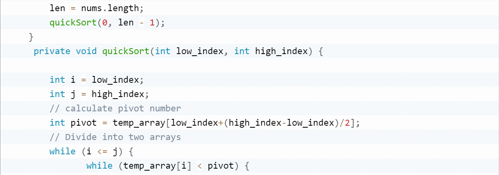
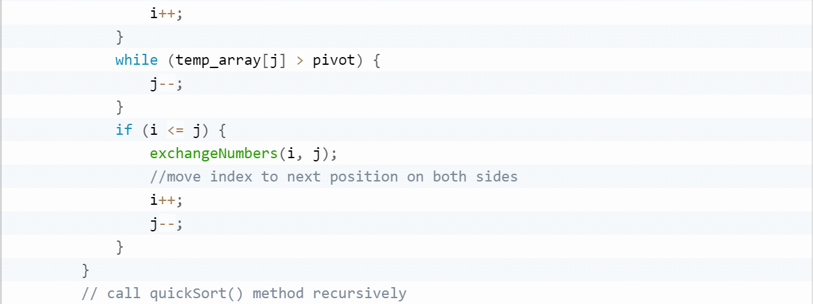
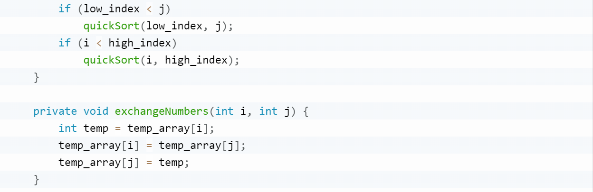
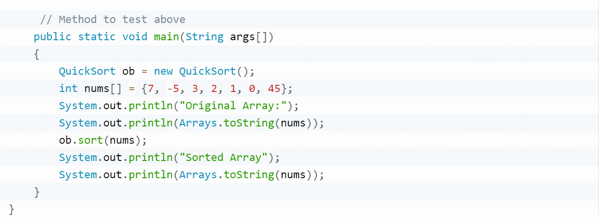
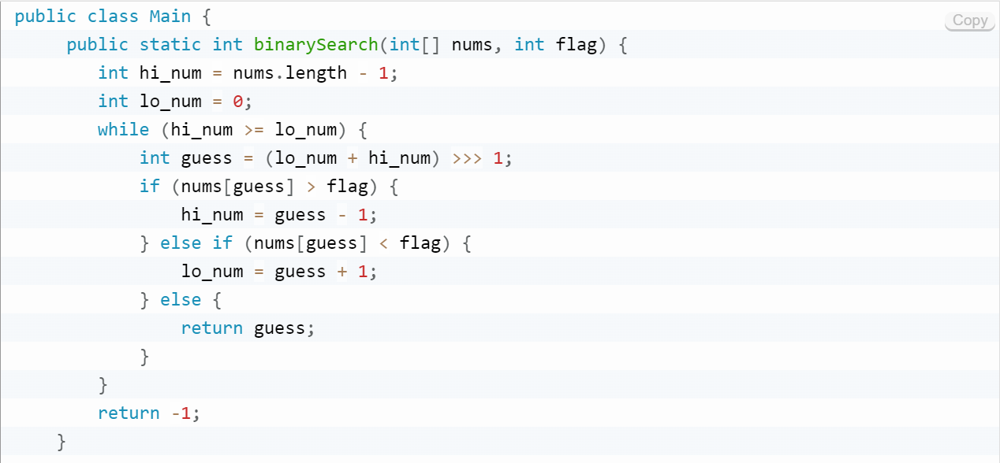
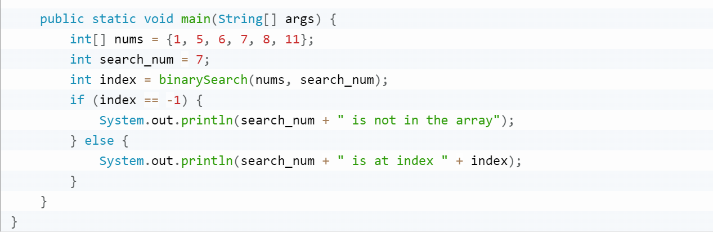

Xiangyue

```java
    /**
     * Search lines in filename contains string key
     * 
     * @param key String
     * @return List of lines constains string key
     * @throws IOException
     */
    public static List<String> search(String filename, String key) throws IOException {
        ArrayList<String> lines = new ArrayList<>();
        FileReader fr = new FileReader(filename);// "./file/english_utf8.txt"
        BufferedReader bf = new BufferedReader(fr);
        String str;
        while ((str = bf.readLine()) != null) {
            lines.add(str);
        }
        fr.close();
        bf.close();

//        if (lines.contains(key)) {
//            System.out.print(lines);
//        } else {
//            System.out.print("不存在该关键词" + key);
//        }

        return lines;
    }
```

1. How to find all lines containing key and return
2. Handle exception

   - filename is null
   - key is null
   - File not exists
   - Chinese file(encoding)

### Hanoi tower

    4 towers

    1 dish-> 1 times
    2 dishes -> 3 times
    3 dishes -> 5 times

    5 dishes
    3 dishes + 2 dishes
    3 dishes -> 5 times
    2 dishes -> 3 times
    3 dishes -> 5 times
    totol 13 times

    6 dishes
    3dishes+3dishes
    3dishes-->5times
    3dishes-->7times
    3dishes-->5times
    totol 17 times
❗
Type all codes manually.
Don't try to copy code from Internet.

1. Write a Java program to sort an array of given integers using Quick sort Algorithm.
   
   
   
   
   

2. Write a Java program to find a specified element in a given array of elements using Binary Search.
   
   
3. Write a Java program to remove spaces between words, change first letter to lowercase, change the first letter to uppercase for other words in a given sentence.
   Example: Do search→doSearch

   public static String toCamel(String words)
