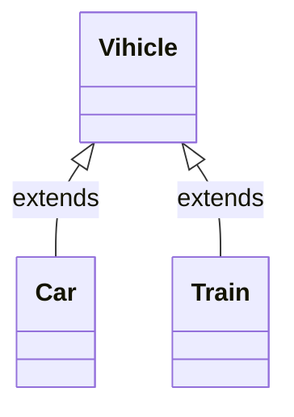
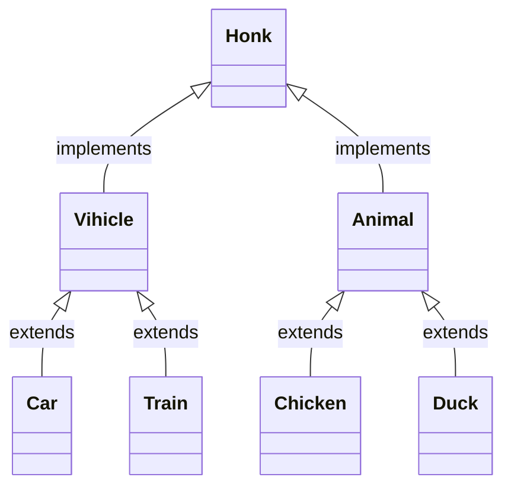
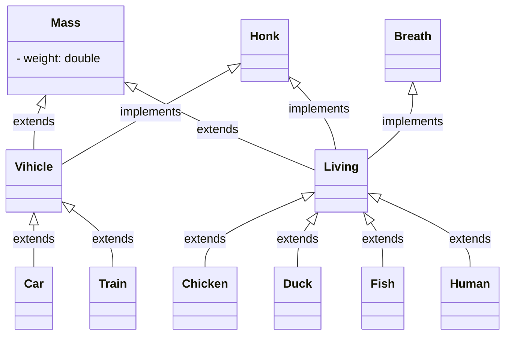

# 面向对象

## 封装
```java
class Car{
    private String name;
    public String getName(){
        return name;
    }
    public void setName(String name){
        this.name = name;
    }
}
```
### 成员变量
```java
private String name;
```
### 成员方法
```java
    public String getName(){
        return name;
    }
    public void setName(String name){
        this.name = name;
    }
```    
## 继承


```java
class Vihicle{
    private String name;
    public String getName(){
        return name;
    }
    public void setName(String name){
        this.name = name;
    }
}
class Car extens Vihicle{
    private String engine;
    public String getEngine(){
        return engine;
    }
    public void setEngine(String engine){
        this.engine = engine;
    }    
}
class Train extens Vihicle{
    private int cars;
    public void setCars(int cars){
        this.cars = cars;
    }
    public int getCars(){
        return cars;
    }
}

```

### 添加新的成员变量
```java
    private String engine;
```
```java
    private int cars;
```
### 添加新的成员方法
```java
    public String getEngine(){
        return engine;
    }
    public void setEngine(String engine){
        this.engine = engine;
    }   
```

```java
    public void setCars(int cars){
        this.cars = cars;
    }
    public int getCars(){
        return cars;
    }
```
## 多态

```java
abstract class Vihicle{
    private String name;
    public String getName(){
        return name;
    }
    public void setName(String name){
        this.name = name;
    }
    abstract public void honk()
    //{
    //
    //}
    ;
}
class Car extens Vihicle{
    private String engine;
    public String getEngine(){
        return engine;
    }
    public void setEngine(String engine){
        this.engine = engine;
    public void honk();
        System.out.println("Di, Di, Di");
    }    
}
class Train extens Vihicle{
    private int cars;
    public void setCars(int cars){
        this.cars = cars;
    }
    public int getCars(){
        return cars;
    }
    public void honk();
        System.out.println("Wuuuuuu, Wuuuuuu....");
    }    
}
```
### 重载成员方法
```java

class Kadiraku extens Car{
    public void honk();
        System.out.println("Ka..., Ka....");
    }    
}
```
# 类和接口



```java
interface Honk{
    void honk();
}
abstract class Vihicle implements Honk{
    abstract public void honk();
}

abstract class Animal implements Honk{
    abstract public void honk();
}
class Chicken implements Animal{
    public void honk(){
        System.out.println("Ge Ge Ge.");
    };
}
class Frag implements Animal{
    public void honk(){
        System.out.println("Gua Gua Gua.");
    };
}
```

# 抽象类
```java
abstract class Animal implements Honk{
    abstract public void honk();
}
```

# 接口的默认实装
```java
interface Honk{
    void honk(){
        System.out.println("");
    };
}
class Vihicle implements Honk{
    private String name;
    public String getName(){
        return name;
    }
    public void setName(String name){
        this.name = name;
    }
}
```

Weight



Breath

# 注釈（Annotation）
