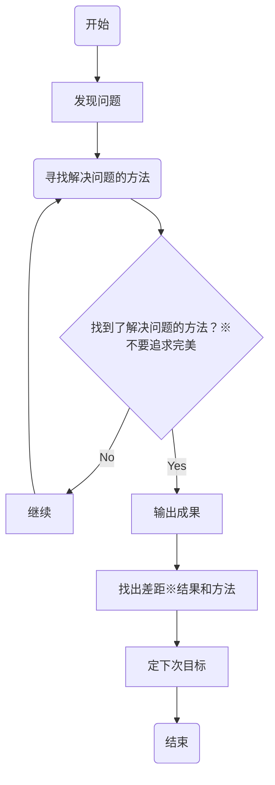

```flow
st=>start: 開始
e=>end: 終了
io1=>operation: 发现问题
sub1=>subroutine: 找到解决问题的方法
cond=>condition: 找到了解决问题的方法？
（※1 不要追求完美）
io2=>subroutine: 输出成果
sub2=>operation: 找出差距
（※2 结果的差距和手段的差距）
op1=>operation: 定下次目标
op2=>operation: Continue
sub3=>subroutine: 继续

st->io1->sub1->cond
cond(yes)->io2->sub2->op1->e
cond(no)->op2(right)->sub1

```

<br/>
<br/>
<br/>
<br/>



<span style="color:red;font-size:small">#没有找到写注释的方法</span>
