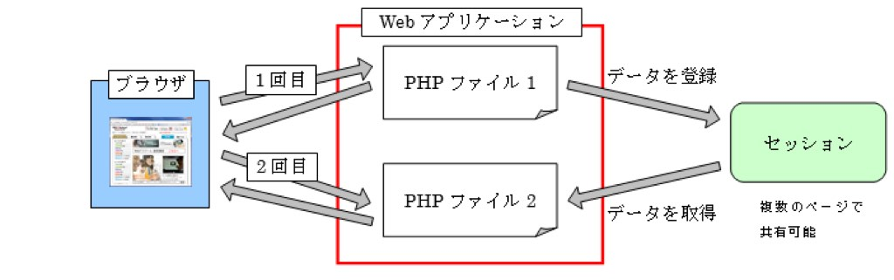
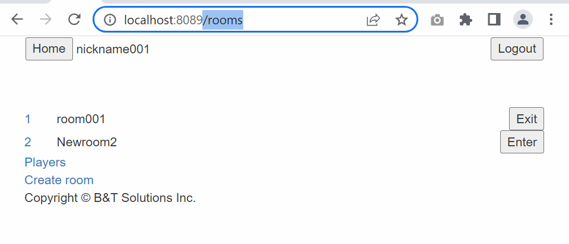
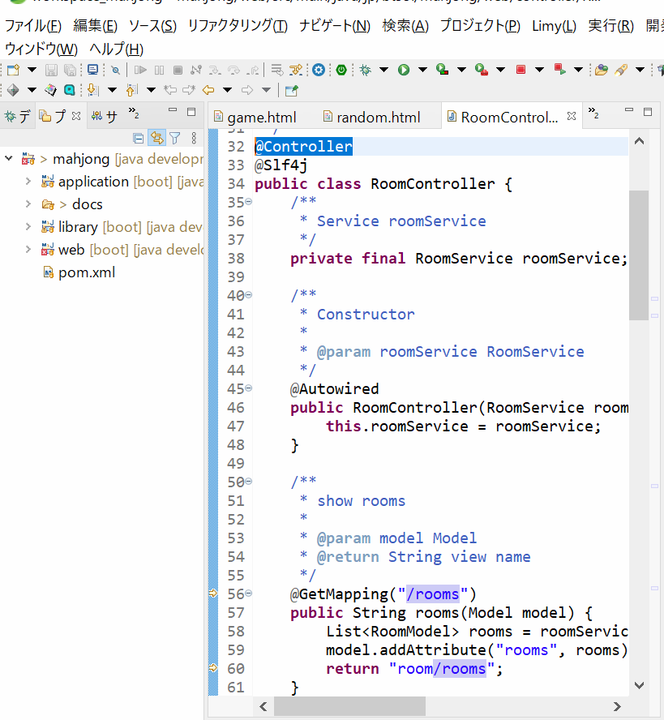
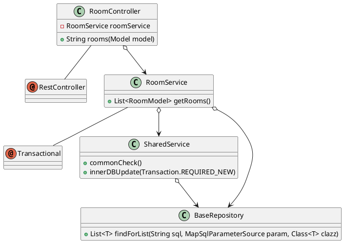
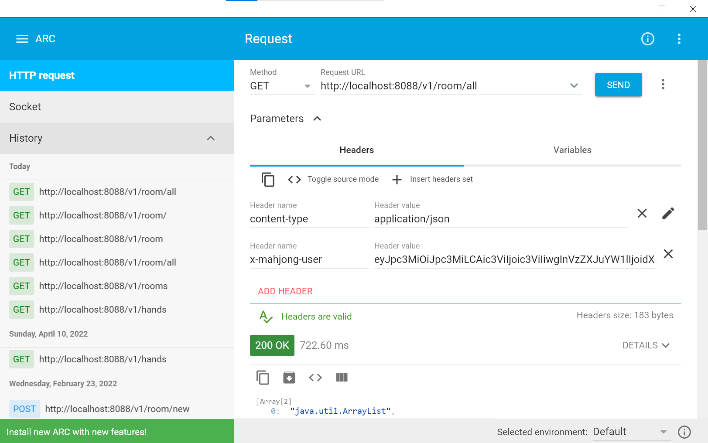
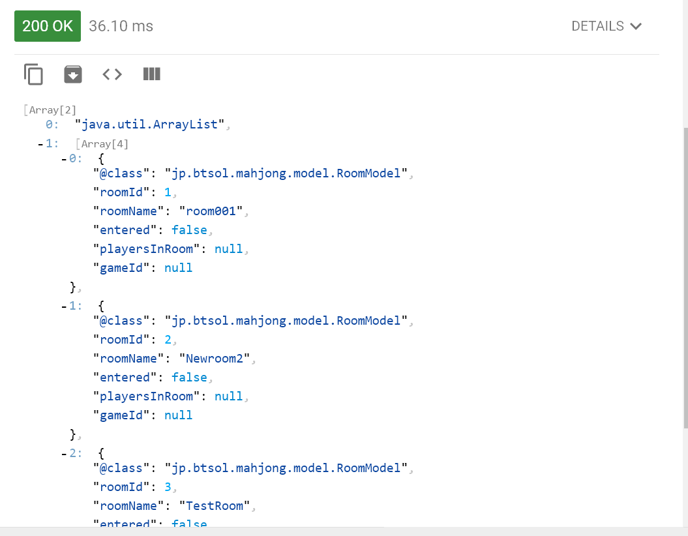
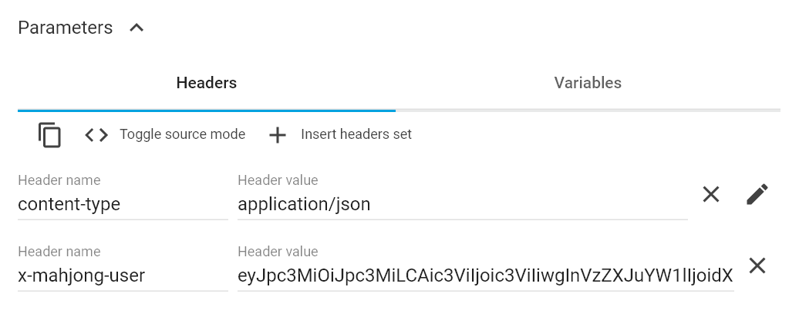
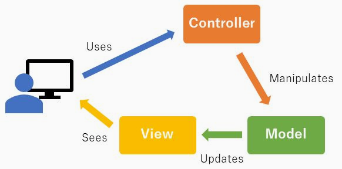
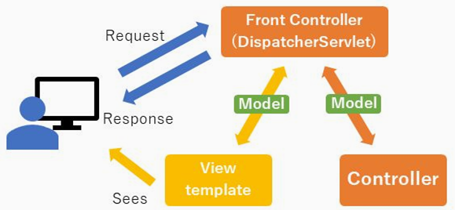

URL
Cookie（クッキー）
Session（セッション）

### URLとは
～特定のページを正確に伝えよう！～

https://www.kbs-web.com/solution/item/hpinfo/url.html

https://www.btsol.jp/static/index.html

#### URLの構成
URLの各部分にも以下のように呼び名があります。
「http://ホスト.ドメイン/ディレクトリ/ディレクトリ/ファイル」
小社のホームぺージのURL「https://www.btsol.jp/static/index.html」を例にすると

- http(https)→protocol
- ホスト→www
   - naked domain
  
- ドメイン→btsol.jp
- ディレクトリ（パス）→static
- ファイル→index.html
となります。

### Cookie（クッキー）

「Cookieとは？」わかりやすく解説｜仕組みや無効化・削除する方法

https://persol-tech-s.co.jp/hatalabo/it_engineer/567.html

Cookieとは、WebサイトやWebサーバーにアクセスした人の情報を、ブラウザに一時的に保存するための仕組みです。Cookieが有効化されると、使用中のブラウザで初めてアクセスしたWebサイトに、Webサイト側が指定した訪問ユーザーを識別できる情報が保存されます。

Cookieでは、そのWebサイトで入力したIDや閲覧情報も記録されるため、２回目以降の訪問時にはこれらの情報をもとにユーザーにスムーズに情報を提供できるようになります。

- Session ID（セッションID）
    - JSESSIONID(Springboot)
    - ci_session(PHP, CodeIgnitor)
### Session（セッション）

セッション とは 意味/解説/説明 【session】

https://webtan.impress.co.jp/g/セッション?amp=

あるWebサイトにアクセスして、そのサイトから出て行くかブラウザを閉じるまでが1セッションとなる。
- セッションのタイムアウト(30分)

#### Session Data（セッションデータ）

クッキーとセッションを利用しよう

https://kanda-it-school-kensyu.com/php-basic-contents/pb_ch11/pb_1103/

セッションを簡単に説明すると「サーバ内に情報を保存し、複数ページ間で共有する」仕組みのことです。
例えば、ショッピングサイトで利用されるカート機能などは、複数の商品ページを遷移し、カートに追加した各商品の情報をずっと保持している必要があります。このような場合にセッションにデータを登録することで、他の画面に遷移してもデータを取り出し利用することができるのです。
セッションでは下の図のようにデータを共有することができます。

### API
APIとは何か？API連携ってどういうこと？図解で仕組みをやさしく解説
https://www.sbbit.jp/article/cont1/62752
#### Web API

### Controller(RestController)
- @GetMapping("/rooms")
 

- @PostMapping("/exitRoom")
  
- @PutMapping("/update")

- Google search
https://www.google.com/search?q=search+console&rlz=1C1FQRR_enJP951JP951&oq=search&aqs=chrome.0.0i512j69i57j0i512l5j69i60.903j0j4&sourceid=chrome&ie=UTF-8

  - Query String

URL:
  - http://localhost:8089/rooms(1-1)   
Controller:
  - @GetMapping("/rooms")(1-2)
  - List<RoomModel> rooms(4-1) = roomService.getRooms();
  - model.addAttribute("rooms"(2-1), rooms(4-2));
  - return "room/rooms";(3-1)
rooms.html(3-2)
  - &lt;tr th:each="room, roomStat: ${rooms}"> (2-2)
  
SpringBoot+Thymeleaf(JSP)

### Service

GET http://localhost:8088/v1/room/all HTTP/1.1
x-mahjong-user: eyJpc3MiOiJpc3MiLCAic3ViIjoic3ViIiwgInVzZXJuYW1lIjoidXNlcm5hbWUiLCAiYml6R3JvdXAiOiJiaXpHcm91cCIsICJjdXN0b21QYXJhbSI6ImN1c3RvbVBhcmFtIn0=

{"iss":"iss", "sub":"sub", "username":"username", "bizGroup":"bizGroup", "customParam":"customParam"}

事务管理
Transaction
https://news.mynavi.jp/article/20200902-1251247/

トランザクション
事例：田中さんの銀行口座から佐藤さんの口座へ5万円振り込む

1. 田中さんの銀行口座に5万円があることを確認する
2. 田中さんの銀行口座から5万円を減らす
3. 佐藤さんの口座に5万円を加える
※日時指定がある場合やメッセージを追加する場合など、さらに処理が加わることもあります。

### Repository
NamedParameterJdbcTemplate

### Bean Copy

### JSON

### Thread Safe

### JUnit
#### DBUnit

#### @Sql

#### Mock(モック)

### RestClient

#### http://localhost:8088/v1/room/all
Chrome Advanced REST client

### MVC

#### Spring MVC
Spring MVCで使用されるMVCはFront Controllerパターンというタイプに分類されます。

#### Spring BootとSpring MVCの違い
- プロジェクト開始時にWebアプリの構築に必要な設定やSpringパッケージが予めデフォルトで設定されており、
- 最低限の選択を行うだけで一般的なアプリに必要な環境構築ができます。
- またアプリケーションの内部に組み込みのアプリケーション・サーバー(Tomcat)を内包しているためサーバーの構築も不要です。
  