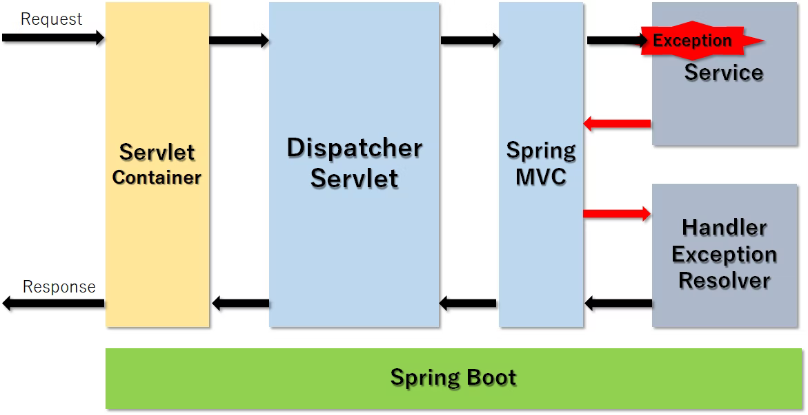

### api
1. Page not found(404)
2. Message not readable(400)
3. Input validation error(400)
   1. BadRequestException
      1. BindingResult
4. Data integrity violation(500)
   1. DuplicateKeyException
5. Communication error(500)
   1. DB stoped(Failed to obtain JDBC Connection)
6. Security error(400)
   1. x-mahjong-userヘッダが認識できませんでした。
   
### web
1. Page not found(404)
   1. login page
2. Input validation error
   1. show erros
3. API error --- no error is shown
   1. show api error
4. Communication error
5. Security error
6. Web is restarted---

### 【SpringBoot入門】フォームのバリデーションチェック
https://qiita.com/morioheisei/items/1d02fa6644d2c355df6e

### リクエストのバリデーション・単項目チェック（SpringBoot）
https://springhack.com/%E3%83%AA%E3%82%AF%E3%82%A8%E3%82%B9%E3%83%88%E3%81%AE%E3%83%90%E3%83%AA%E3%83%87%E3%83%BC%E3%82%B7%E3%83%A7%E3%83%B3%E3%83%BB%E5%8D%98%E9%A0%85%E7%9B%AE%E3%83%81%E3%82%A7%E3%83%83%E3%82%AF%EF%BC%88sp/

### Spring Bootでリダイレクト先にパラメータを渡す方法
https://grandbig.github.io/blog/2016/05/28/redirect-parameter-spring-boot/

addAttribute（文字列のみ）⇒@RequestParameter⇒URLの末尾に?QueryStringとしてパラメータを受け取る

addFlashAttribute（ModelMap型可）⇒@ModelAttribute("model")ModelMap modelMap⇒リロード時に保持されない

### SpringBootの例外ハンドリング
https://qiita.com/haseesah/items/6b0f0fcfe681734e2617
#### HandlerExcepitonResolver

#### ErrorPage

#### ErrorController
