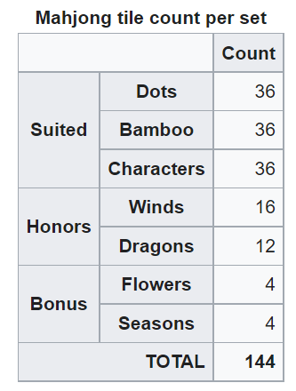
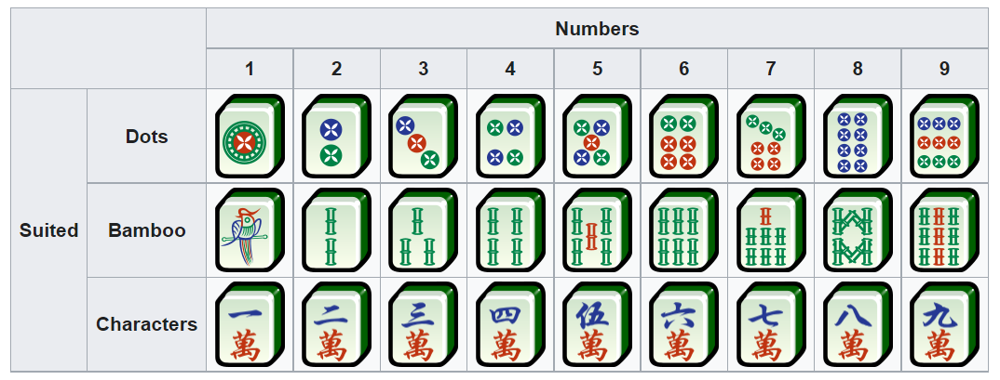
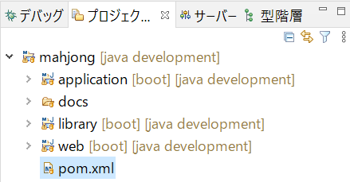
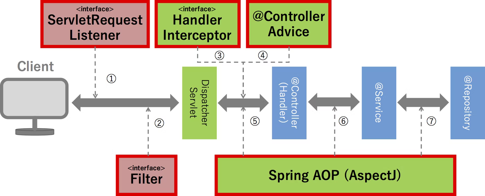
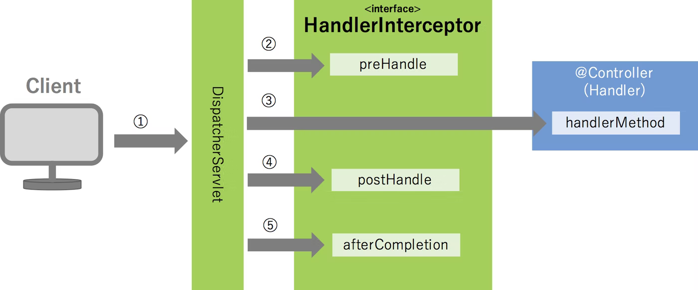

 [mahjong4j github](https://github.com/mahjong4j/mahjong4j.git)

## Beginner
Make mvn project with multiple modules
1. Google searh "mnv springboot create multiproject"
2. [Creating a Multi Module Project](https://spring.io/guides/gs/multi-module/)
3. $ `mkdir mahjong`
4. $ `cd mahjong`
1. $ `mkdir library`
2. $ `mkdir application`
1. $ `mkdir -p application/src/main/java/jp/btsol/mahjong/application`
2. $ `mkdir -p library/src/main/java/jp/btsol/mahjong/service/`
1. $ `mkdir -p library/src/test/java/jp/btsol/mahjong/service/`
3. $ `mvn install && mvn spring-boot:run -pl application`
1. http://localhost:8088/
 
1. $ `git init`
2. $ `git add .`
1. $ `git commit -m init`

`mvn package -Dmaven.test.skip=true -Dmaven.javadoc.skip=true`

`mvn spring-boot:run -Dspring-boot.run.jvmArguments="-agentlib:jdwp=transport=dt_socket,server=y,suspend=n,address=8188" -Dmaven.test.skip=true -Dmaven.javadoc.skip=true`

[Spring Bootとは? Spring BootでWebアプリ開発を始めるために必要な知識を紹介](https://i-common-tech.jp/column/940)

   [Spring BootでThymeleafを使ってhello worldを表示させる方法には？](https://i-common-tech.jp/column/940#Spring+Boot%E3%81%A7Thymeleaf%E3%82%92%E4%BD%BF%E3%81%A3%E3%81%A6hello+world%E3%82%92%E8%A1%A8%E7%A4%BA%E3%81%95%E3%81%9B%E3%82%8B%E6%96%B9%E6%B3%95%E3%81%AB%E3%81%AF%EF%BC%9F)

## [逆にWebAPIを呼び出してみよう編](https://zenn.dev/sugaryo/books/spring-boot-run-up/viewer/api_call)
  [RestTemplateラッパー三点セット](https://zenn.dev/sugaryo/books/spring-boot-run-up/viewer/api_call#%E2%96%A0resttemplate%E3%83%A9%E3%83%83%E3%83%91%E3%83%BC%E4%B8%89%E7%82%B9%E3%82%BB%E3%83%83%E3%83%88)
## Advanced
[組み込み Web サーバー](https://spring.pleiades.io/spring-boot/docs/2.1.4.RELEASE/reference/html/howto-embedded-web-servers.html)
    HTTP ポートを変更する
    ランダムな未割り当ての HTTP ポートを使用する
    実行時に HTTP ポートを発見する
    HTTP レスポンス圧縮を有効にする
    SSL を構成する
    HTTP/2 を構成する
    サーブレット、フィルター、またはリスナーをアプリケーションに追加する
        Spring Bean を使用して、サーブレット、フィルター、またはリスナーを追加する
        クラスパススキャンを使用してサーブレット、フィルター、リスナーを追加する
    アクセスログを構成する
    フロントエンドプロキシサーバーの背後で実行する
    @ServerEndpoint を使用して WebSocket エンドポイントを作成する

[How to reload templates without restarting the spring boot application?](https://github.com/thymeleaf/thymeleaf/issues/614)

[Mahjong](https://en.wikipedia.org/wiki/Mahjong)






## Projects


|Project|Function|
|--|--|
|web|front end|
|application|api|
|library|common library|
|database|jpa|


[Spring MVC(+Spring Boot)上でのリクエスト共通処理の実装方法を理解する](https://qiita.com/kazuki43zoo/items/757b557c05f548c6c5db)




## Mixin:
[Adding Custom Properties Using Jackson MixIns](https://medvector.github.io/programming/jackson/jackson-trick/)

[Java : Jackson による JSON デシリアライズ時の型解決方法](https://www.techscore.com/blog/2016/06/17/java-jackson-polymorphic-deserialization/)

- Java
  -  Springboot(Framework) Spring Wicket Struts 
- Database (Oracle, MySQL, Postgresql)
  - JDBC
  - JPA
  - Hibernate
  - Mybatis
  - JdbcTemplate
  - jooq

  [Java & Databases: An Overview of Libraries & APIs](https://www.marcobehler.com/guides/java-databases)
- RestAPI    
- Thymeleaf, Wicket, JSP, Apache Velocity
- HTML
- CSS
- JS

how-to-run.md

### Mahjong room
#### Create new room
#### Invite player
#### Enter room as player
#### Invite visitor
#### Enter room as visitor

#### List all rooms
#### Private room

### Play Mahjong
#### Sitting
#### Shuffling
#### [掷色子](https://www.goocode.net/demo/dice/index.php) to decide Zhuangjia(Dealer, East player)
#### Decide where to pick tiles
#### Pick tiles
#### Play
#### Pay
#### Record wins and loses

[简单的麻将ai算法](https://doc.xuwenliang.com/docs/ai/1495)

### List all branches
    $ git branch -a
    * development
    mvn
    remotes/origin/20220205_xiangyang_homework
    remotes/origin/20220205_xiangyang_homework1
    remotes/origin/20220205_xinwei_homework
    remotes/origin/HEAD -> origin/development
    remotes/origin/development
    remotes/origin/main
    remotes/origin/mvn

    systemi@PC526 MINGW64 /c/app/java (development)

### Delete local branch

    $ git branch --delete mvn
    Deleted branch mvn (was 73b94d9).

    systemi@PC526 MINGW64 /c/app/java (development)

### Prune remote branch

    $ git fetch --prune
    From https://github.com/javastudyaccount/java
    - [deleted]         (none)     -> origin/mvn

    systemi@PC526 MINGW64 /c/app/java (development)
### Delete remote branch
    $ git push --delete origin 20220205_xiangyang_homework    
### List all branches again
    $ git branch -a
    * development
    remotes/origin/20220205_xiangyang_homework
    remotes/origin/20220205_xiangyang_homework1
    remotes/origin/20220205_xinwei_homework
    remotes/origin/HEAD -> origin/development
    remotes/origin/development
    remotes/origin/main

    systemi@PC526 MINGW64 /c/app/java (development)

### Create DDL from database
using pgAdmin
- Right-click on your database (or schema).
- Choose "backup"
- Under "Format" choose "plain"
- Under "Dump Options #1" choose "Only schema"
- Under "Objects" choose the tables you want.
- Then click "backup". The output should be a plain text file with the create table statements.


Response Responsibility
No response -> No Responsibility

Goal
1. Job
2. Job Searching
3. Certificate
 Java Programmer Certificate
 Information Primary Skill


Ni: IT Passport       
   基本情報技術者試験  
    
   Java First
Xiangyang: 中級SE（C）
    PM？
    日本語 N3、N2

Xiangyue: Java
    計算機等級

Wenjing: Java

### Docker
    Windows 10 ビルド 18917 以降であること
    コマンドプロンプトから確認

    1. コマンドプロンプトを開く
    2. verコマンドを実行
    3. 出てきたバージョンが18917以上ならOK！

   - [WSL install](https://docs.microsoft.com/zh-cn/windows/wsl/install)
   `PS> wsl --install`

   - [Docker install](https://docs.docker.com/engine/install/ubuntu/#install-using-the-repository)
     - Set up the repository
       - `PS> wsl`
       - `$  sudo apt-get update`
       - `$ sudo apt-get install ca-certificates curl gnupg lsb-release`
       - `$ curl -fsSL https://download.docker.com/linux/ubuntu/gpg | sudo gpg --dearmor -o /usr/share/keyrings/docker-archive-keyring.gpg`
       - `$  echo "deb [arch=$(dpkg --print-architecture) signed-by=/usr/share/keyrings/docker-archive-keyring.gpg] https://download.docker.com/linux/ubuntu \
  $(lsb_release -cs) stable" | sudo tee /etc/apt/sources.list.d/docker.list > /dev/null`
     - Install Docker Engine
       - `$ sudo apt-get update`
       - `$ sudo apt-get install docker-ce docker-ce-cli containerd.io`
     - Manually start docker
       - `$ sudo /etc/init.d/docker start`
     - Verify that Docker Engine
       - `$ sudo docker run hello-world`
   - Set Docker Daemon auto start
      - `$ echo "# Start dockerd" >> ~/.bashrc`
      - `$ echo "sudo /etc/init.d/docker start" >> ~/.bashrc`
   - Set default user as root
     - `PS> ubuntu config --default-user root` 

[mysql.md](./mysql.md)

[er.md](./er.md)

### API Test
#### Curl
```shell
curl  -X POST -v -H "request-id:requestid" -H "Content-Type:application/json" -H "api-key:AAAAAAA" -d "test name" http://localhost:8088/v1/room/new 
```
```json
< HTTP/1.1 200
< Content-Type: application/json

{
  "roomId" : 22,
  "roomName" : "{\"roonName\":\"test name\"}",
  "deletedFlg" : false,
  "createdTimestamp" : "2022-02-20T07:38:39.000+00:00",
  "createdUser" : "default",
  "updatedTimestamp" : "2022-02-20T07:38:39.000+00:00",
  "updatedUser" : "default"
}
```
#### Advanced REST client


[Is there a method built in spring MockMVC to get json content as Object?](https://stackoverflow.com/questions/51873620/is-there-a-method-built-in-spring-mockmvc-to-get-json-content-as-object)


MVC:
   - M: Model
   - V: View
   - C: Controller

Address bar:
URL: `http://   localhost: 8089  /tiles`
     `[protocol]://[hostname]:[port][path]`


     path: @GetMapping("/tiles")

     html: tiles.html

- /
- /hands
- /rooms
- /tiles/arranged
- /tiles
- /tiles/random
- /tiles/shuffled

```sql
mysql> insert into room (room_name, deleted_flg, created_timestamp, created_user, updated_timestamp, updated_user) values ('test 82', 0, current_timestamp, 'test', current_timestamp, 'test');
```
```sql
mysql> select * from room;
```

```sql
mysql> insert into room (room_name, deleted_flg, created_timestamp, created_user, updated_timestamp, updated_user) values ('東京', 0, current_timestamp, 'test', current_timestamp, 'test');
```


### Rest Cient

GET http://localhost:8088/v1/room/all HTTP/1.1
x-mahjong-user: eyJpc3MiOiJpc3MiLCAic3ViIjoic3ViIiwgInVzZXJuYW1lIjoidXNlcm5hbWUiLCAiYml6R3JvdXAiOiJiaXpHcm91cCIsICJjdXN0b21QYXJhbSI6ImN1c3RvbVBhcmFtIn0=

{"iss":"iss", "sub":"sub", "username":"username", "bizGroup":"bizGroup", "customParam":"customParam"}

###

POST http://localhost:8088/v1/shuffled HTTP/1.1
content-type: application/json
request-id: test-id
x-mahjong-user: eyJpc3MiOiJpc3MiLCAic3ViIjoic3ViIiwgInVzZXJuYW1lIjoidXNlcm5hbWUiLCAiYml6R3JvdXAiOiJiaXpHcm91cCIsICJjdXN0b21QYXJhbSI6ImN1c3RvbVBhcmFtIn0=
 
{"gameId": 1}
###

POST http://localhost:8088/v1/room/new HTTP/1.1
content-type: application/json
request-id: test-id
x-mahjong-user: eyJpc3MiOiJpc3MiLCAic3ViIjoic3ViIiwgInVzZXJuYW1lIjoidXNlcm5hbWUiLCAiYml6R3JvdXAiOiJiaXpHcm91cCIsICJjdXN0b21QYXJhbSI6ImN1c3RvbVBhcmFtIn0=
 
{"roomName": "testRoom23"}

###

POST http://localhost:8088/v1/room/new HTTP/1.1
content-type: application/json
request-id: request-id

"test room name"

###

POST http://localhost:8088/v1/room/new HTTP/1.1
content-type: application/json
request-id: request-id

東京ドーム

###

POST http://localhost:8088/v1/room/new HTTP/1.1
content-type: application/json
request-id: request-id

東京ドーム<br/>第一号


Schedule:


registerObjectMappersForType

### Majhong game

- [X] Player registration
  - [X] API
  - [X] Web
- [ ] Open a room
- [ ] Begin a game
- [ ] Play a game

### github

1344161724@qq.com

javastudyaccount/javastudy123


### mvn test
# Run all the unit test classes.
$ mvn test

# Run a single test class.
$ mvn -Dtest=TestApp1 test

# Run multiple test classes.
$ mvn -Dtest=TestApp1,TestApp2 test

# Run a single test method from a test class.
$ mvn -Dtest=TestApp1#methodname test

# Run all test methods that match pattern 'testHello*' from a test class.
$ mvn -Dtest=TestApp1#testHello* test

# Run all test methods match pattern 'testHello*' and 'testMagic*' from a test class.
$ mvn -Dtest=TestApp1#testHello*+testMagic* test

$ mvn clean test -Djacoco.skip=true
