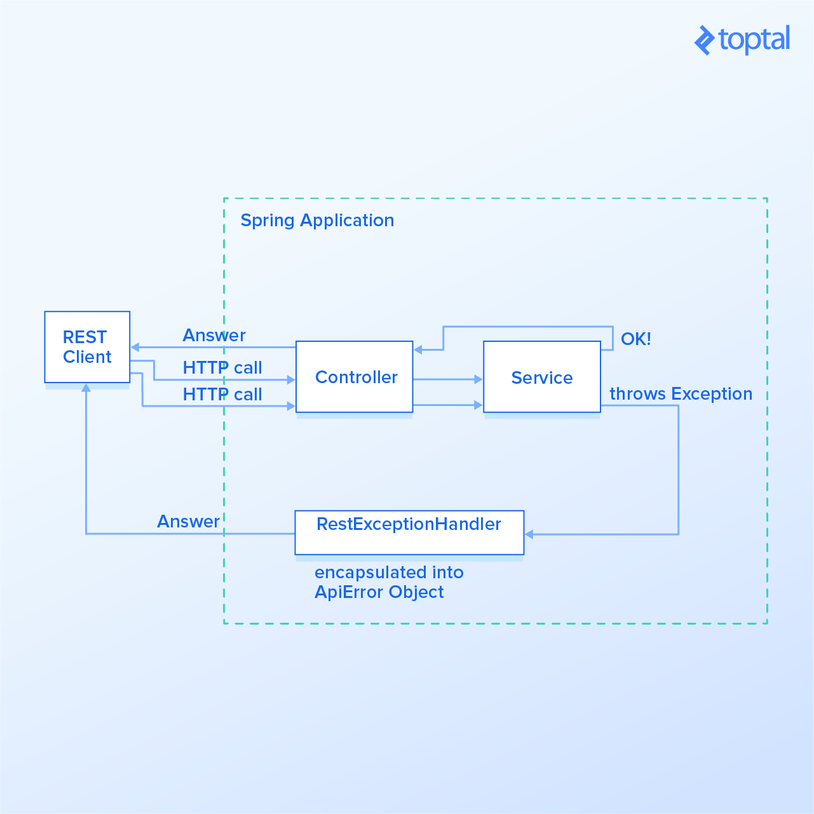

###

http://localhost:8088/v1/player/all
x-mahjong-user: eyJpc3MiOiJpc3MiLCAic3ViIjoic3ViIiwgInVzZXJuYW1lIjoidXNlcm5hbWUiLCAiYml6R3JvdXAiOiJiaXpHcm91cCIsICJjdXN0b21QYXJhbSI6ImN1c3RvbVBhcmFtIn0=

###

post http://localhost:8088/v1/player/new
x-mahjong-user: eyJpc3MiOiJpc3MiLCAic3ViIjoic3ViIiwgInVzZXJuYW1lIjoidXNlcm5hbWUiLCAiYml6R3JvdXAiOiJiaXpHcm91cCIsICJjdXN0b21QYXJhbSI6ImN1c3RvbVBhcmFtIn0=
content-type: application/json

{"@class": "jp.btsol.mahjong.model.Nickname","nickname": "12345678901234567895"}

###

post http://localhost:8088/v1/player/new
x-mahjong-user: eyJpc3MiOiJpc3MiLCAic3ViIjoic3ViIiwgInVzZXJuYW1lIjoidXNlcm5hbWUiLCAiYml6R3JvdXAiOiJiaXpHcm91cCIsICJjdXN0b21QYXJhbSI6ImN1c3RvbVBhcmFtIn0=
request-id: test-from-vscode
content-type: application/json

{"@class": "jp.btsol.mahjong.model.Nickname","nickname": "12345678901234567895"}

###

POST http://localhost:8088/v1/player/new
x-mahjong-user:eyJpc3MiOiJpc3MiLCAic3ViIjoic3ViIiwgInVzZXJuYW1lIjoidXNlcm5hbWUiLCAiYml6R3JvdXAiOiJiaXpHcm91cCIsICJjdXN0b21QYXJhbSI6ImN1c3RvbVBhcmFtIn0= 
request-id:new
Content-Type:application/json

{"playerId":0, "nickname":"player7", "deletedFlg":false, "createdTimestamp":null, "createdUser":null, "updatedTimestamp":null, "updatedUser":null}

###

POST http://localhost:8088/v1/player/new
x-mahjong-user:eyJpc3MiOiJpc3MiLCAic3ViIjoic3ViIiwgInVzZXJuYW1lIjoidXNlcm5hbWUiLCAiYml6R3JvdXAiOiJiaXpHcm91cCIsICJjdXN0b21QYXJhbSI6ImN1c3RvbVBhcmFtIn0= 
request-id:new
Content-Type:application/json

{"@class": "jp.btsol.mahjong.model.Nickname", "nickname":"player10player10player10player10player10player10player10"}

###

POST http://localhost:8088/v1/player/new
x-mahjong-user:eyJpc3MiOiJpc3MiLCAic3ViIjoic3ViIiwgInVzZXJuYW1lIjoidXNlcm5hbWUiLCAiYml6R3JvdXAiOiJiaXpHcm91cCIsICJjdXN0b21QYXJhbSI6ImN1c3RvbVBhcmFtIn0= 
request-id:new
Content-Type:application/json

{"@class":"jp.btsol.mahjong.model.Nickname", "nickname": "aaa"}


###

POST http://localhost:8088/v1/player/new
x-mahjong-user:eyJpc3MiOiJpc3MiLCAic3ViIjoic3ViIiwgInVzZXJuYW1lIjoidXNlcm5hbWUiLCAiYml6R3JvdXAiOiJiaXpHcm91cCIsICJjdXN0b21QYXJhbSI6ImN1c3RvbVBhcmFtIn0= 
request-id:new
Content-Type:application/json

{"@class": "jp.btsol.mahjong.model.Nickname","nickname":""}

###

POST http://localhost:8088/v1/player/new
request-id:new
Content-Type:application/json

{"nickname":""}


### Spring Boot エンティティー精査
https://www.ne.jp/asahi/hishidama/home/tech/java/spring/boot/rest/validation.html

### DeserializationProblemHandler
https://www.ne.jp/asahi/hishidama/home/tech/java/spring/boot/rest/jackson.html#h_DeserializationProblemHandler

### Spring BootでRest Apiを作る際の注意点
https://qiita.com/take_ksk/items/845dfe496b2d4e6baac3

```json
{
  "@class" : "jp.btsol.mahjong.entity.Room",
  "roomId" : 1,
  "roomName" : "test room",
  "deletedFlg" : false,
  "createdTimestamp" : [ "java.sql.Timestamp", "2022-03-21 13:57:19" ],
  "createdUser" : "test-id",
  "updatedTimestamp" : [ "java.sql.Timestamp", "2022-03-21 13:57:19" ],
  "updatedUser" : "test-id"
}
```

om.configure(SerializationFeature.WRITE_DATES_AS_TIMESTAMPS, false);
```json
{
  "@class" : "jp.btsol.mahjong.entity.Room",
  "roomId" : 1,
  "roomName" : "test room",
  "deletedFlg" : false,
  "createdTimestamp" : [ "java.sql.Timestamp", 1647865414984 ],
  "createdUser" : "test-id",
  "updatedTimestamp" : [ "java.sql.Timestamp", 1647865414984 ],
  "updatedUser" : "test-id"
}
```

`No type information(om.setDefaultTyping(createAllowlistedDefaultTyping());)`
```json
{
  "roomId" : 1,
  "roomName" : "test room",
  "deletedFlg" : false,
  "createdTimestamp" : "2022-03-21T12:32:36.738+00:00",
  "createdUser" : "test-id",
  "updatedTimestamp" : "2022-03-21T12:32:36.738+00:00",
  "updatedUser" : "test-id"
}
```

MessageCodesResolver messageCodesResolver

###

post http://localhost:8088/v1/room/new
x-mahjong-user: eyJpc3MiOiJpc3MiLCAic3ViIjoic3ViIiwgInVzZXJuYW1lIjoidXNlcm5hbWUiLCAiYml6R3JvdXAiOiJiaXpHcm91cCIsICJjdXN0b21QYXJhbSI6ImN1c3RvbVBhcmFtIn0=
request-id: test-from-vscode
content-type: application/json

{"roomName": "testroom1"}

###

get http://localhost:8088/v1/room/all
x-mahjong-user: eyJpc3MiOiJpc3MiLCAic3ViIjoic3ViIiwgInVzZXJuYW1lIjoidXNlcm5hbWUiLCAiYml6R3JvdXAiOiJiaXpHcm91cCIsICJjdXN0b21QYXJhbSI6ImN1c3RvbVBhcmFtIn0=
request-id: test-from-vscode
content-type: application/json

###

POST http://localhost:8088/v1/room/new
request-id:new
Content-Type:application/json

{"roomName":""}

###

POST http://localhost:8088/v1/room/new
x-mahjong-user: eyJpc3MiOiJpc3MiLCAic3ViIjoic3ViIiwgInVzZXJuYW1lIjoidXNlcm5hbWUiLCAiYml6R3JvdXAiOiJiaXpHcm91cCIsICJjdXN0b21QYXJhbSI6ImN1c3RvbVBhcmFtIn0=
request-id:new
Content-Type:application/json

{"roomName":""}
