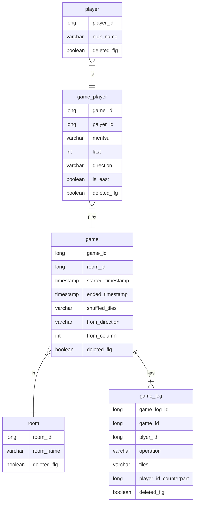

ER Diagram

```mermaid
erDiagram
room{
    long room_id
    varchar room_name 
    boolean deleted_flg
}

player{
    long player_id
    varchar nick_name 
    boolean deleted_flg
}

game{
   long game_id
   long room_id
   timestamp started_timestamp
   timestamp ended_timestamp
   varchar shuffled_tiles
   varchar from_direction
   int from_column
   boolean deleted_flg
}

game_player{
   long game_id
   long palyer_id
   varchar mentsu
   int last
   varchar direction
   boolean is_east
   boolean deleted_flg
}

game_log{
   long game_log_id
   long game_id
   long plyer_id
   varchar operation
   varchar tiles
   long player_id_counterpart
   boolean deleted_flg
}

game }|--|| room :in
player }|--|| game_player : is
game_player }|--|| game: play
game ||--|{ game_log :has

```
