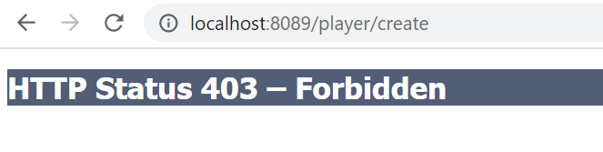
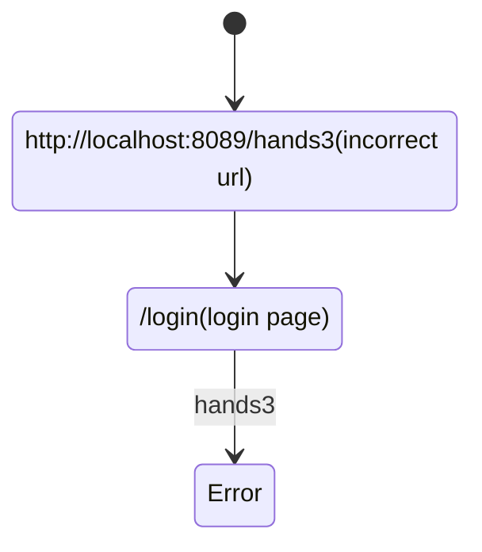
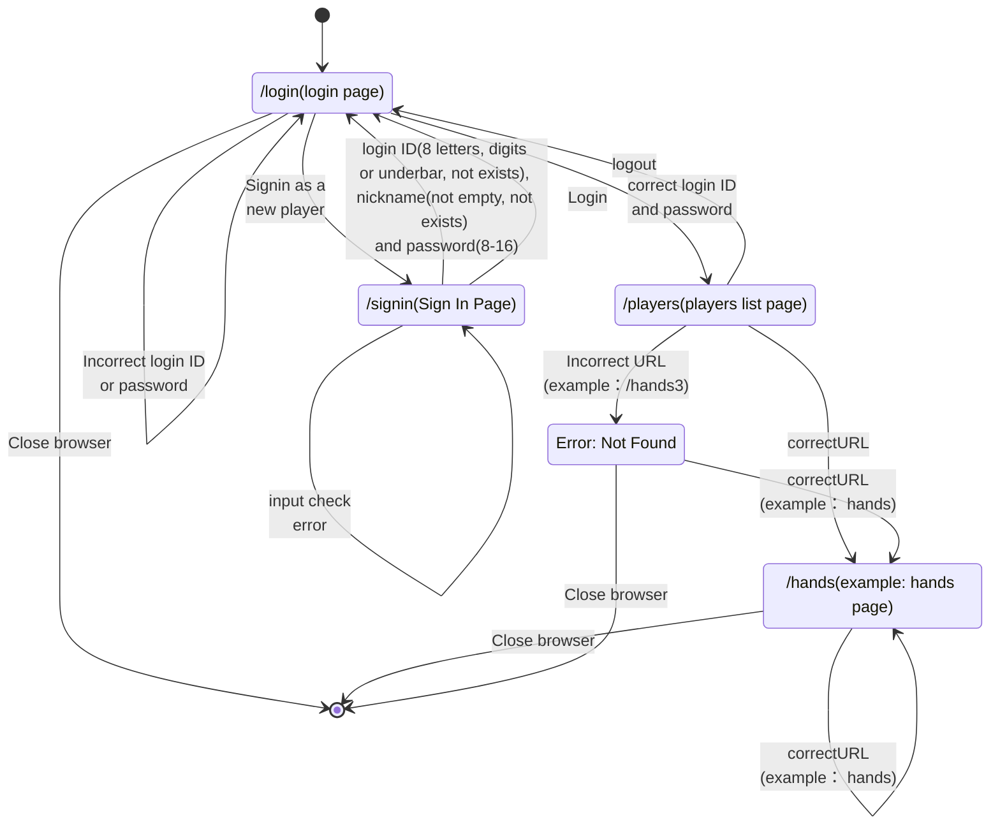
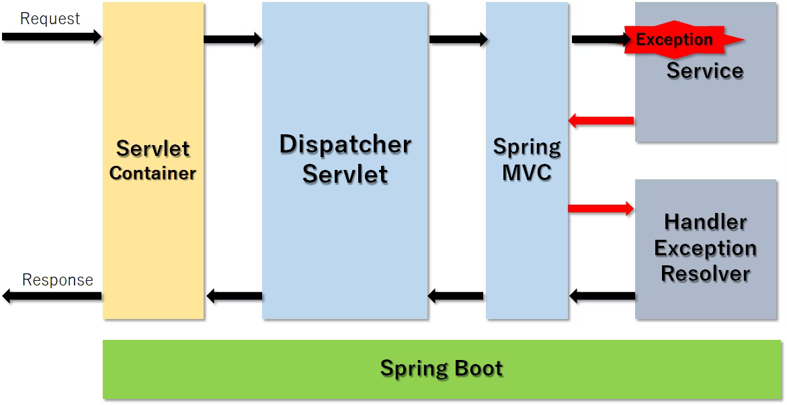
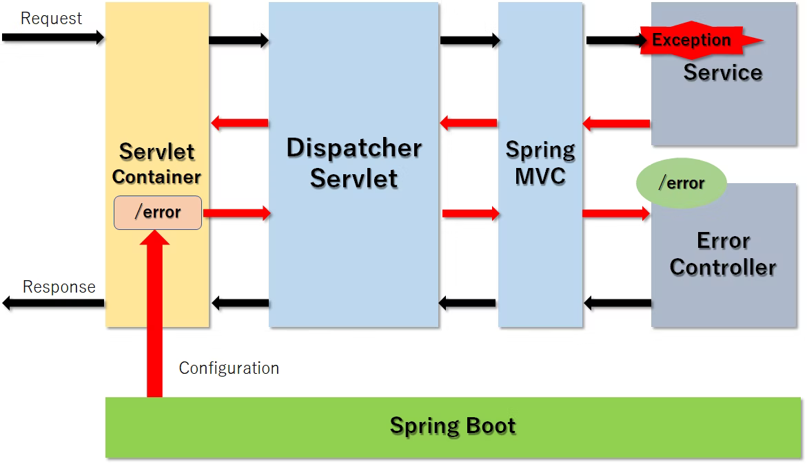
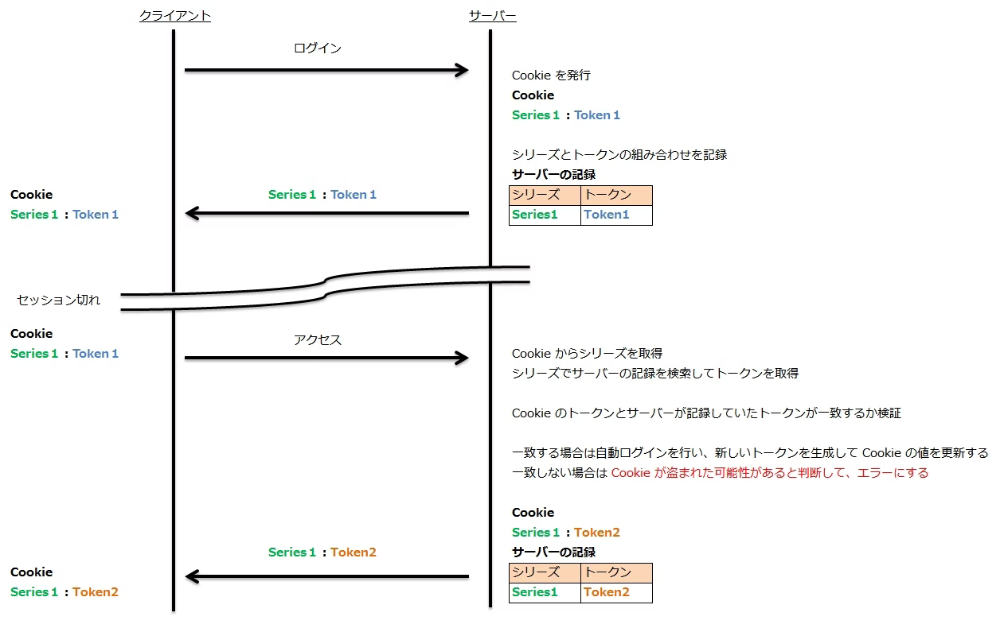
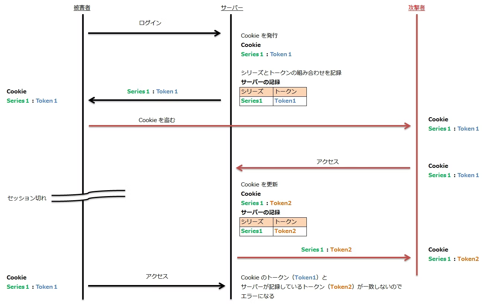

### api
1. Page not found(404)
2. Message not readable(400)
3. Input validation error(400)
   1. BadRequestException
      1. BindingResult
4. Data integrity violation(500)
   1. DuplicateKeyException
5. Communication error(500)
   1. DB stoped(Failed to obtain JDBC Connection)
6. Security error(400)
   1. x-mahjong-userヘッダが認識できませんでした。
   
- [ ] Error when application is not started

### web
1. Page not found(404)
   1. login page
2. Input validation error
   1. show erros
3. API error --- no error is shown
   1. show api error
4. Communication error
5. Security error
6. Web is restarted---

7. Error->Top page

### test case
1. URL not exists
   1. http://localhost:8089/login
      1. http://localhost:8089/login
2. No login ID, password and login
   1. Please confirm your login ID and password. 
3. Not valid login ID, password
   1. Please confirm your login ID and password.
4. Valid login ID and password
      1. http://localhost:8089/players
      2. Home
         1. This is majhong application.
      3. Logout
         1. http://localhost:8089/afterLogout
      4. Signin as a new player
         1. http://localhost:8089/signin
      5. Existing url
         1. http://localhost:8089/login
5. Existing url after login
   1. http://localhost:8089/hands OK 
6. URL not exists after login
   1. http://localhost:8089/hands3
      1. Error: Not Found
         timestamp: Mon Apr 04 20:20:24 JST 2022
         status: 404
         path: /hands3
7. EmptyResultDataAccessException
   1. DataNotFoundException
8. Session timeout ?
9. Show login page twice after restart server
10. focus on the first input field
11. 

1. No redirect after logged in
2. Remember me

TokenBasedRememberMeServices:
   makeTokenSignature

### 【SpringBoot入門】フォームのバリデーションチェック
https://qiita.com/morioheisei/items/1d02fa6644d2c355df6e

### リクエストのバリデーション・単項目チェック（SpringBoot）
https://springhack.com/%E3%83%AA%E3%82%AF%E3%82%A8%E3%82%B9%E3%83%88%E3%81%AE%E3%83%90%E3%83%AA%E3%83%87%E3%83%BC%E3%82%B7%E3%83%A7%E3%83%B3%E3%83%BB%E5%8D%98%E9%A0%85%E7%9B%AE%E3%83%81%E3%82%A7%E3%83%83%E3%82%AF%EF%BC%88sp/

### Spring Bootでリダイレクト先にパラメータを渡す方法
https://grandbig.github.io/blog/2016/05/28/redirect-parameter-spring-boot/

addAttribute（文字列のみ）⇒@RequestParameter⇒URLの末尾に?QueryStringとしてパラメータを受け取る

addFlashAttribute（ModelMap型可）⇒@ModelAttribute("model")ModelMap modelMap⇒リロード時に保持されない

### SpringBootの例外ハンドリング
https://qiita.com/haseesah/items/6b0f0fcfe681734e2617
#### HandlerExcepitonResolver

#### ErrorPage

#### ErrorController

#### SpringBootログイン認証の実装
https://qiita.com/curry__30/items/276ba2b9236066683ba4

### Spring-Bootでログイン機能を実装してみる
https://qiita.com/a-pompom/items/80b3f4bb6414e8678829

### Spring Security Remember Me
https://www.baeldung.com/spring-security-remember-me

### Spring Securityでログインした状態を残す
https://eatsmart.hatenablog.com/entry/2021/01/15/172838

### spring boot その9 - spring security で Remember-Me認証を行う
https://huruyosi.hatenablog.com/entry/2015/08/16/132503

### Spring Security 使い方メモ　Remember-Me
https://qiita.com/opengl-8080/items/7c34053c74448d39e8f5
   - Remember-Me によるログインの場合は重要な処理の実行を許可しない
   - Cookie が盗まれたことを検知できるようにする
  
  

### 暗号ハッシュ関数
   - 一貫性：同じデータが与えられた場合、ハッシュ関数は常に同じ値を返します。すなわち、X = Yの場合、f（x）は常にハッシュ関数fに対してf（y）に等しい。

   - 一意性：ハッシュ関数への2つの入力は、同じ出力をもたらすことはありません。つまり、XとYの任意の値に対して、X！= Y、f（x）！= f（y）ならば、

   - 不可逆性：不可能ではないにしても、ハッシュ関数を「逆転する」ことは非実用的です。すなわち、f（X）のみが与えられれば、元のXが関数f（ブルートフォース）を介してすべての可能な値をとるのを忘れることはできません。 f1（f（X））= Xとなるような関数f1は存在してはならない。

現在セキュアであると考えられる機能の中には、SHA-256とSHA-512があります。

### パスワードハッシュ化
https://terasolunaorg.github.io/guideline/public_review/Security/PasswordHashing.html

### Spring Security の DelegatingPasswordEncoder について調べた
https://qiita.com/d-yosh/items/bb52152318391e5e07aa

### JavaでAES（ECB／CBC）を使う
https://kazuhira-r.hatenablog.com/entry/2021/01/10/200607

### Spring Bootでリダイレクト先のURLを組み立てる
https://qiita.com/rubytomato@github/items/8d132dec042f695e50f6

### Thymeleaf 3.0を使用した入力フォームのサンプル
https://qiita.com/rubytomato@github/items/8da1bb19537bbfc9c2ea
