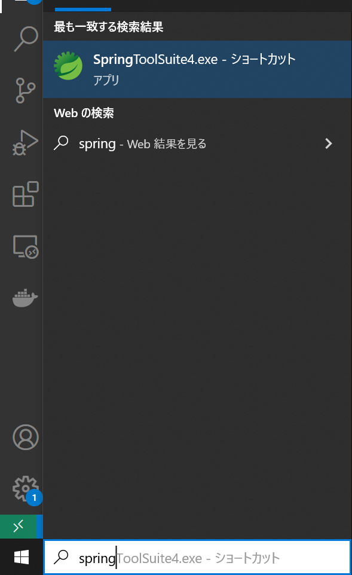
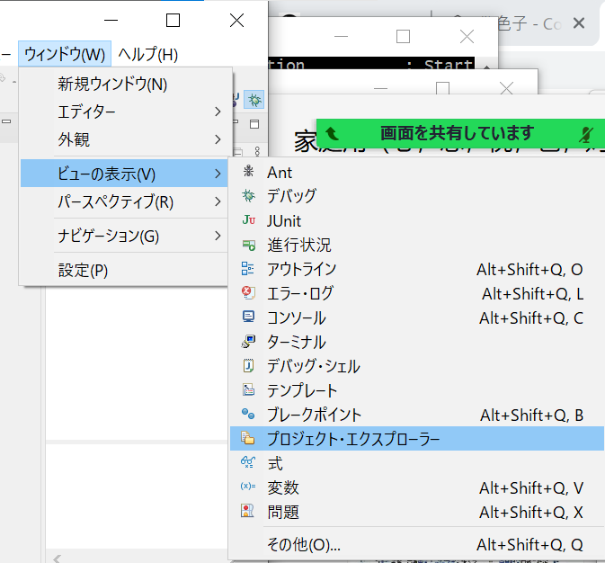
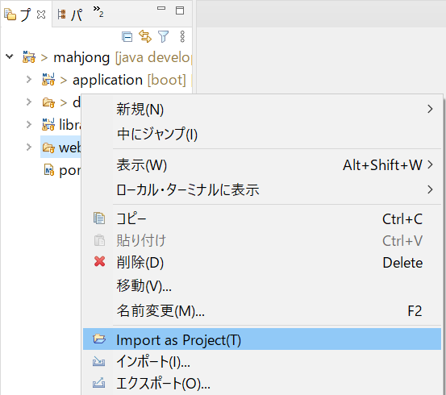
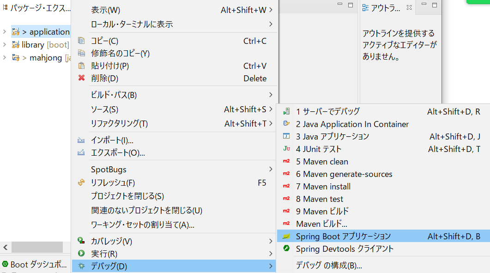
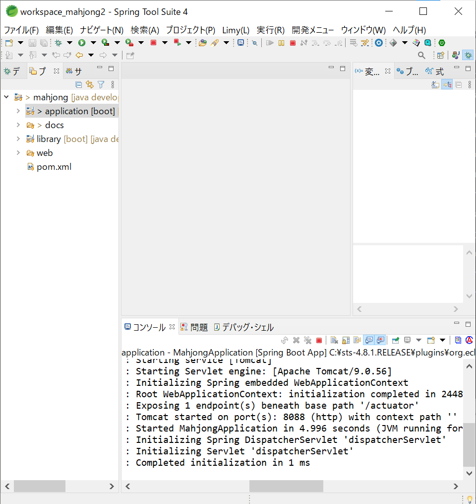
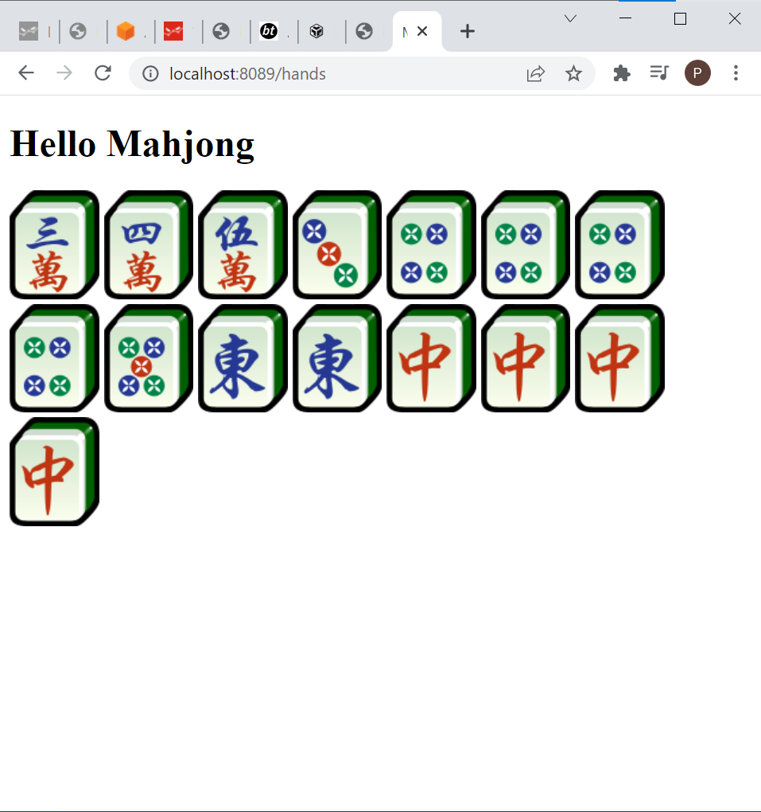

### How to run
1. Set environment variable
   1. spring.profiles.active=local
2. Install Java 1.11

3. Install SpringToolSuite4
4. Intall lombok.jar
   `java -jar lombok.jar`
5. Start SpringToolSuite4

    
6. Select workspace
   
7. Import project
   
8. Import existing maven project
   
9.  Select mahjong project
   
11. Open project explorer
   
12. Three modules imported
      
11. Import web as project
      
   
12. Run application
   
13. Application started at port 8088
   

chcp.com 932

14. mvn
   mvn clean package -Dmaven.test.skip=true -Dmaven.javadoc.skip=true
15. [Spring Boot Actuatorで開発の効率化を図ってみた](https://qiita.com/HiroyaEnd/items/f640a6cd2657c42c69a2)
   listup all paths:
   `curl http://localhost:9999/admin/mappings | grep patterns`
   Output example:
   <pre>
    "patterns" : [ "/error" ],
    "patterns" : [ "/hands" ],
    "patterns" : [ "/" ],
    </pre>
16. Test a api

   *Authentication header is required.*
   - VSCode:
   Use Rest Client plugin to send following request.
   ```
   http://localhost:8088/v1/hands
   x-mahjong-user: eyJpc3MiOiJpc3MiLCAic3ViIjoic3ViIiwgInVzZXJuYW1lIjoidXNlcm5hbWUiLCAiYml6R3JvdXAiOiJiaXpHcm91cCIsICJjdXN0b21QYXJhbSI6ImN1c3RvbVBhcmFtIn0=
   ```

   Response:
   
   HTTP/1.1 200 
   ...(omitted)

   - Advanced REST client for Chrome
   
1.  Run web
   
18. Web started at port 8089
      
19. Test a web page

   *Login is required*
   You can sign in first.
   http://localhost:8089/hands
   
   [Shuffling video](media/shuffling.mp4)
   [Dicing video](media/dice.mp4)

[uiflow](./uiflow.uif)

### Start web and application 
`cd /c/app/java/mahjong`
`chcp.com 932`
`mvn install -Dmaven.test.skip=true -Dmaven.javadoc.skip=true`

`cd /c/app/java/mahjong/web`
`mvn spring-boot:run -Dspring-boot.run.jvmArguments="-agentlib:jdwp=transport=dt_socket,server=y,suspend=n,address=8189"`

`cd /c/app/java/mahjong/application`
`mvn spring-boot:run -Dspring-boot.run.jvmArguments="-agentlib:jdwp=transport=dt_socket,server=y,suspend=n,address=8188"`
