# Java study
1. ```git clone https://github.com/javastudyaccount/java.git```
 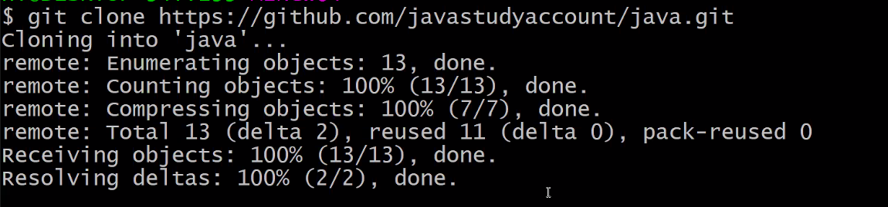
 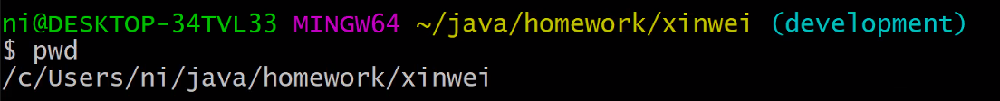
 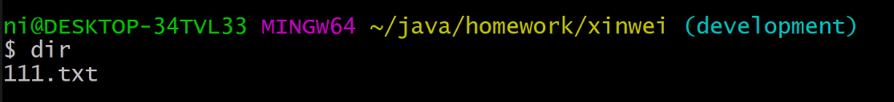
1. ```git add .```
2. ```git status```
   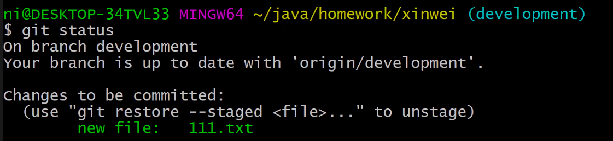
1. ```git commit -m comment```
   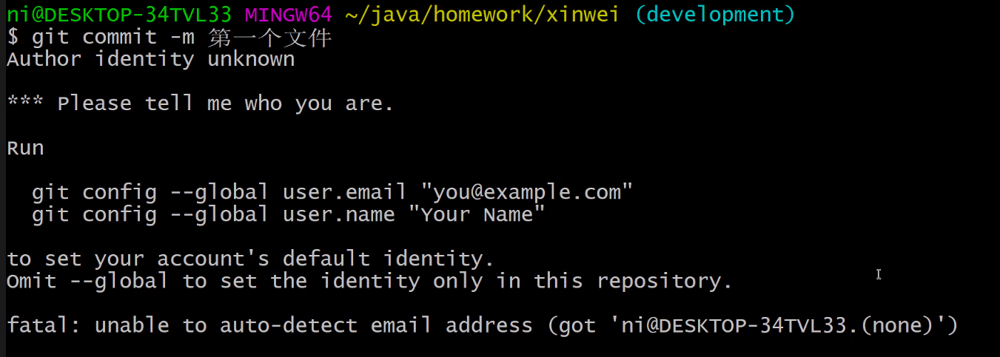

   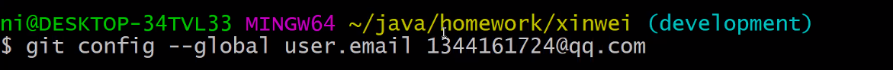
   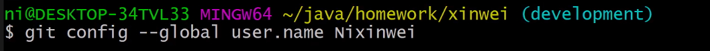

   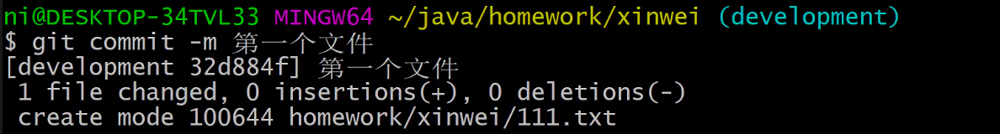
1. ```git push```

   <br/>
   <br/>
    javastudyaccount/javastudy123

   <br/>
   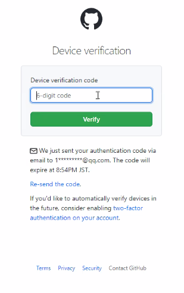<br/>
   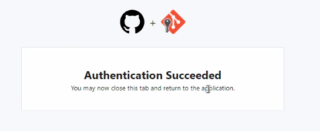<br/>
   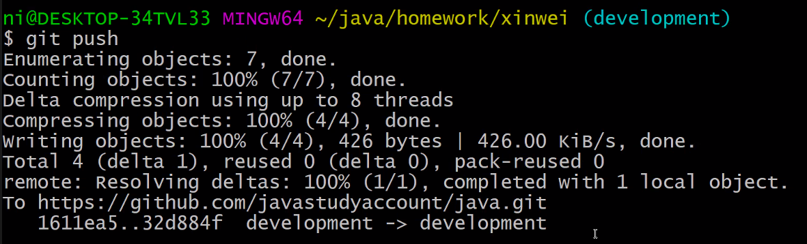<br/>
1. ```git pull```
  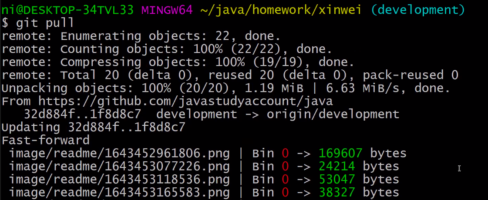
  